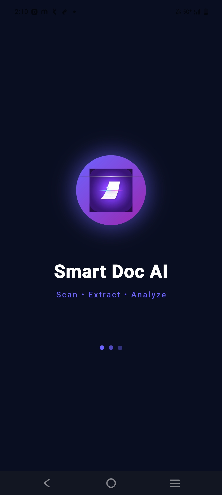
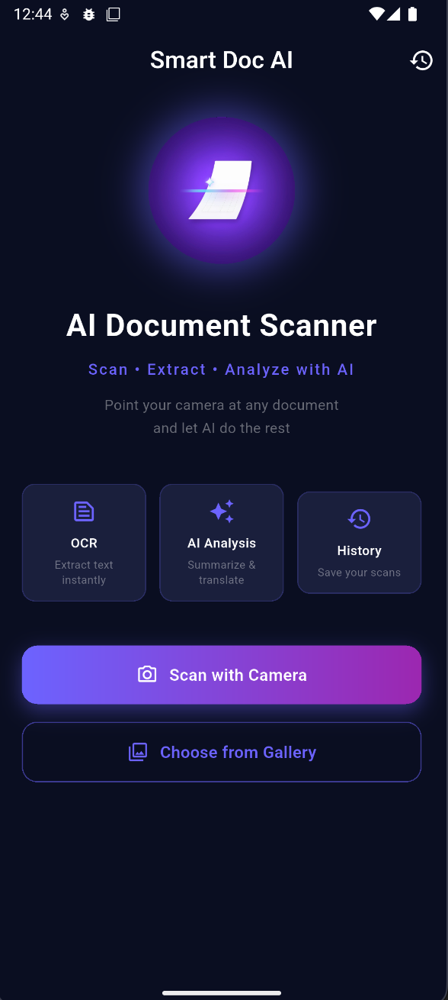
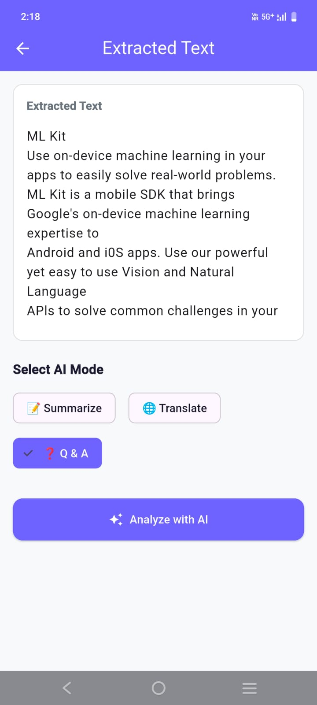
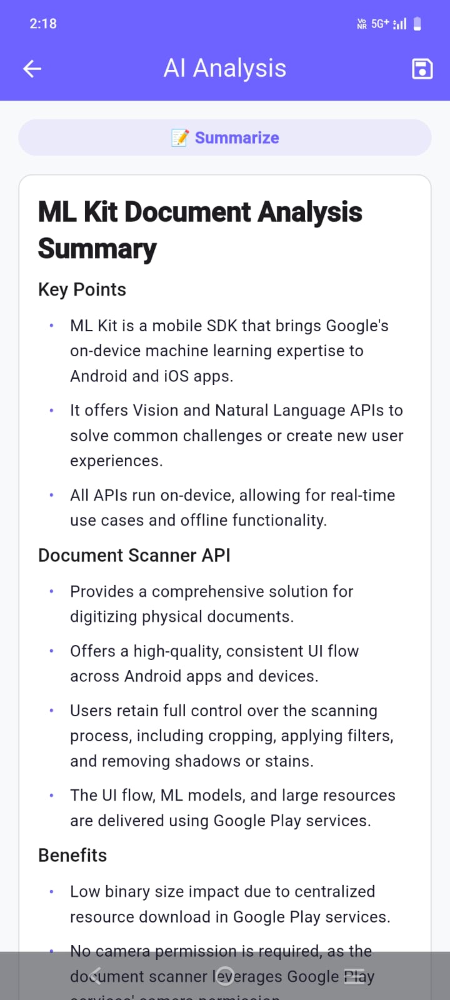

# Smart Doc AI 📄✨

AI-powered document scanner built with Flutter — scan any document, extract text with OCR, analyze with Groq AI.

---

## Screenshots

| Splash | Home | OCR Result | AI Analysis |
|--------|------|------------|-------------|
|  |  |  |  |

---

## Features
- 📷 Scan via camera or gallery
- 🔍 On-device OCR (Google ML Kit) — works offline
- 🤖 AI Analysis powered by Groq (Llama 3.1)
- 📝 3 AI Modes — Summarize, Translate, Q&A
- 💾 Local history with Hive
- 🌙 Dark theme with animations

---

## Tech Stack

| Package | Purpose |
|---------|---------|
| flutter_riverpod | State management |
| google_mlkit_text_recognition | On-device OCR |
| http | Groq API calls |
| hive_flutter | Local storage |
| flutter_dotenv | API key management |
| flutter_markdown | Render AI response |

---

## Architecture

```
Service → Repository → Provider → Screen
```

```
lib/
├── core/
│   ├── api/groq_api_service.dart
│   └── services/ocr_service.dart
├── repositories/
│   ├── ocr_repository.dart
│   ├── groq_repository.dart
│   └── history_repository.dart
├── providers/
│   ├── ocr_provider.dart
│   ├── ai_provider.dart
│   └── history_provider.dart
├── models/
│   └── scan_record.dart
└── features/
    ├── splash/
    ├── home/
    ├── ocr_result/
    ├── ai_analysis/
    └── history/
```

---

## Setup

```bash
git clone https://github.com/yourusername/smart_doc_ai.git
cd smart_doc_ai
flutter pub get
```

Create `.env` file in root:
```
GROQ_API_KEY=your_key_here
```

Get free Groq API key → [console.groq.com](https://console.groq.com)

```bash
dart run build_runner build --delete-conflicting-outputs
flutter run
```

---

## Why These Choices?

| Decision | Reason |
|----------|--------|
| ML Kit for OCR | Free, offline, on-device — image never leaves phone |
| Groq for AI | Free tier, fastest inference, no credit card |
| Riverpod | Compile-time safety, testable, clean separation |
| Clean Architecture | Each layer independent — easy to swap any part |

---

> Built with Flutter + Groq AI (Llama 3.1)

---

## 🤝 Contributing

Contributions are welcome!

1. Fork the repo
2. Create your branch — `git checkout -b feature/amazing-feature`
3. Commit changes — `git commit -m 'Add amazing feature'`
4. Push — `git push origin feature/amazing-feature`
5. Open a Pull Request

---

## 📜 Code of Conduct

This project follows a simple code of conduct:

- **Be respectful** — treat everyone with kindness
- **Be constructive** — give helpful feedback
- **Be inclusive** — welcome developers of all skill levels
- **No harassment** — zero tolerance for abusive behavior

Report issues to: your@email.com

---

## 📄 MIT License

```
MIT License

Copyright (c) 2026 sumit kumar


> Built with ❤️ using Flutter + Groq AI (Llama 3.1)